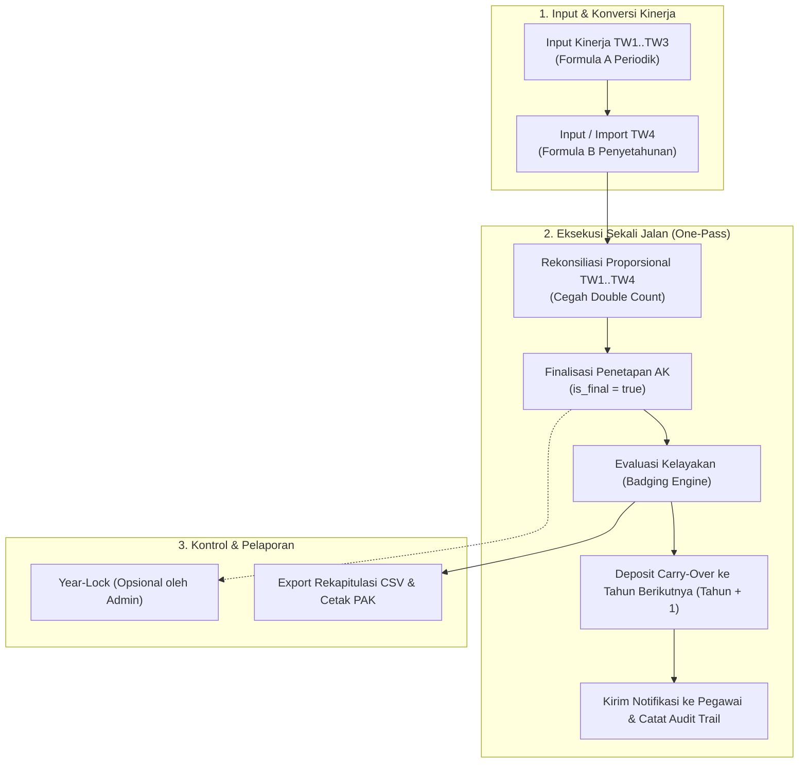

# 🏛️ Sistem Konversi Angka Kredit Kinerja Pegawai KPK (v2)

Sistem Informasi Terintegrasi berbasis **Web Modern (React 19 + TypeScript + Vite + Tailwind CSS)** dan **Backend Engine (Laravel 12 / PHP 8.3)** untuk pengelolaan, konversi, evaluasi kelayakan kenaikan pangkat/jenjang, serta penetapan Angka Kredit (AK) Jabatan Fungsional secara individual maupun massal sesuai standar **Peraturan BKN Nomor 3 Tahun 2023** dan **PermenPANRB Nomor 1 Tahun 2023**.

---

## 📑 Daftar Isi
1. [Dasar Regulasi & Konsep Utama](#-dasar-regulasi--konsep-utama)
2. [Fitur-Fitur Unggulan Sistem](#-fitur-fitur-unggulan-sistem)
3. [Arsitektur & Tumpukan Teknologi](#-arsitektur--tumpukan-teknologi)
4. [Alur Kerja Sistem (Workflows)](#-alur-kerja-sistem-workflows)
5. [Sistem Badge & Logika Kelayakan (Badging Engine)](#-sistem-badge--logika-kelayakan-badging-engine)
6. [Studi Kasus UAT: Sdr. Budi (Multi-Tahun)](#-studi-kasus-uat-sdr-budi-multi-tahun)
7. [Panduan Instalasi & Menjalankan](#-panduan-instalasi--menjalankan)
8. [Pengujian Otomatis (Testing)](#-pengujian-otomatis-testing)
9. [Katalog Endpoint REST API](#-katalog-endpoint-rest-api)

---

## 📜 Dasar Regulasi & Konsep Utama

Sistem ini mengimplementasikan aturan kepegawaian ASN/KPK terkini:
*   **Koefisien Tahunan Jabatan Fungsional Keahlian**:
    *   **Ahli Pertama**: `12.5` AK/tahun (Target KP: `50 AK`, Target Jenjang: `100 AK`)
    *   **Ahli Muda**: `25.0` AK/tahun (Target KP: `100 AK`, Target Jenjang: `200 AK`)
    *   **Ahli Madya**: `37.5` AK/tahun (Target KP: `150 AK`, Target Jenjang: `450 AK`)
    *   **Ahli Utama**: `50.0` AK/tahun (Target KP: `200 AK`, Target Jenjang: `9999 AK`)
*   **Persentase Konversi Predikat Kinerja**:
    *   *Sangat Baik*: `150%` (faktor 1.50)
    *   *Baik*: `100%` (faktor 1.00)
    *   *Butuh Perbaikan*: `75%` (faktor 0.75)
    *   *Kurang*: `50%` (faktor 0.50)
    *   *Sangat Kurang*: `25%` (faktor 0.25)
*   **Angka Kredit Dasar (AK Dasar)**:
    *   Golongan Pintu Masuk Jenjang (III/a, III/c, IV/a) $\rightarrow$ **`0 AK`**.
    *   Golongan Lanjutan (III/b $\rightarrow$ **`50 AK`**, III/d $\rightarrow$ **`100 AK`**, IV/b $\rightarrow$ **`150 AK`**, IV/c $\rightarrow$ **`300 AK`**) $\rightarrow$ Mendapat modal dasar otomatis sesuai pangkat.

---

## ✨ Fitur-Fitur Unggulan Sistem

### 1. 📥 Smart Import Konversi Massal (Excel `.xlsx` & `.csv`)
*   **Native OpenXML Parser**: Membaca file `.xlsx` dan `.csv` secara cepat tanpa dependensi library pihak ketiga yang berat.
*   **Dua Mode Eksekusi Terpisah**:
    *   **Mode Tahunan**: Menghitung kinerja tahunan setahun penuh (Formula B), rekonsiliasi triwulan, auto-finalisasi PAK, pembuatan deposit carry-over tahun berikutnya, notifikasi pegawai, dan audit trail.
    *   **Mode Triwulan (TW1–TW4)**: Mengimpor capaian kinerja periodik kuartal tertentu tanpa mengubah status final tahunan atau carry-over.
*   **Intelligent Auto-Matching**: Mengenali NIP, Nama, Golongan, Jenjang, dan Predikat secara fuzzy & case-insensitive.
*   **Dry-Run / Live Preview**: Validasi visual hasil kalkulasi, deteksi error baris, dan preview badge kelayakan sebelum data di-commit ke database.
*   **Year-Lock Protection**: Baris data yang tahun penetapannya telah dikunci oleh admin otomatis dilewati (*skipped*) untuk mencegah modifikasi tidak sengaja.
*   **Template Generator**: Fitur download template resmi CSV/Excel berstandar langsung dari aplikasi.

### 2. ✍️ Input Kinerja Manual & Live Simulation
*   **Pencatatan Evaluasi TW1–TW4**: Form periodik triwulanan interaktif dengan visualisasi progres live.
*   **Rekonsiliasi Proporsional Otomatis (Formula B)**: Saat TW4 disimpan/diperbarui, nilai angka kredit TW1–TW3 direkonsiliasi proporsional berdasarkan bulan aktif sehingga jumlah seluruh triwulan persis sama dengan perolehan tahunan (*zero-drift & no double count*).
*   **Finalisasi Sekali Jalan (*One-Pass Execution*)**: Input TW4 otomatis menyelesaikan perhitungan, menetapkan PAK tahun berjalan (`is_final = true`), membentuk carry-over tahun depan, dan mengirim notifikasi tanpa perlu tombol finalisasi terpisah.
*   **Deteksi Batas Kenaikan Jenjang (*Grade Boundary*)**: Mengenali pegawai di batas jenjang (misal III/d $\to$ IV/a) untuk mengarahkan target evaluasi ke promosi jenjang.
*   **Pendaftaran Pegawai Baru Lengkap**: Form tambah pegawai langsung mendukung input Masa Kerja (Tahun & Bulan) serta Saldo AK Historis dengan penyesuaian flat 100 AK jika ada mismatch jenjang.

### 3. 🎓 Booster Ijazah Baru (+25% Angka Kredit)
*   **Pengajuan Mandiri Pegawai**: Pegawai dapat mengunggah berkas Ijazah baru dan Surat Pencantuman Gelar / Keabsahan BKN.
*   **Auto-Validation 3 Syarat Ketat BKN**:
    1. Strata pendidikan yang diajukan harus lebih tinggi dari pendidikan terakhir.
    2. Predikat kinerja evaluasi terakhir minimal berpredikat **"Baik"** ($\ge 100\%$).
    3. Belum pernah mengklaim bonus pada strata pendidikan yang sama.
*   **Approval Workflow Admin**: Verifikasi dokumen oleh admin langsung menambahkan bonus $+25\%$ dari target kenaikan pangkat (misal Ahli Pertama target 50 AK $\rightarrow$ bonus **`+12.50 AK`**) ke saldo kumulatif tahun berjalan.

### 4. 🔒 Year-Lock & Keamanan Data (Gembok Tahun)
*   **Year-Lock Manual Admin**: Admin berhak mengunci (`Lock`) atau membuka kembali (`Unlock`) tahun evaluasi pegawai tertentu.
*   **Data Immutability**: Seluruh endpoint evaluasi kinerja manual dan proses import massal memblokir pengubahan data pada tahun yang terkunci.

### 5. 🏷️ Rekapitulasi PAK & Badging Engine
*   **Komposisi Akumulasi Multi-Komponen**:
    $$\text{AK Kumulatif} = \text{AK Dasar} + \text{PAK Pelantikan} + \text{Saldo Historis} + \text{AK Lama} + \text{AK Baru} + \text{Booster}$$
*   **Badging Status Real-Time**:
    *   🟢 **`[LAYAK NAIK PANGKAT]`**: Target KP tercapai, kelebihan saldo otomatis ditabung (*carry-over*).
    *   🟢 **`[LAYAK NAIK JENJANG]`**: Target Promosi Jenjang tercapai, sisa AK direset ke 0 (*hangus* sesuai aturan BKN).
    *   🟠 **`[BELUM CUKUP AK UNTUK NAIK PANGKAT]`**: Target belum tercapai dalam jenjang sama, seluruh saldo dibawa ke tahun depan.
    *   🟠 **`[BELUM CUKUP AK UNTUK NAIK JENJANG]`**: Target promosi jenjang belum tercapai di golongan puncak, seluruh saldo dibawa ke tahun depan.
*   **Export Laporan**: Mengunduh rekapitulasi data PAK seluruh pegawai ke dalam format CSV.

### 6. 🛡️ Autentikasi, Hak Akses (RBAC) & Audit Trail
*   **Role-Based Access Control**:
    *   `ADMIN` (Kepegawaian): Hak penuh kelola pegawai, verifikasi ijazah, import massal, input evaluasi, lock/unlock tahun, dan rekapitulasi.
    *   `PEGAWAI`: Dashboard mandiri, visualisasi progres AK, riwayat evaluasi, dan pengajuan booster ijazah.
*   **Audit Trail Compliance**: Merekam jejak audit di setiap aksi kritis (CREATE, UPDATE, DELETE, LOCK, UNLOCK, APPROVE, BULK_IMPORT) lengkap dengan identitas pengguna, IP address, User-Agent, dan diff data (*before vs after*).
*   **Pusat Notifikasi**: Notifikasi in-app otomatis untuk hasil konversi tahunan dan status verifikasi pendidikan.

---

## 🏗️ Arsitektur & Tumpukan Teknologi

### Frontend
*   **Framework**: React 19 dengan TypeScript
*   **Build Tool**: Vite 8 / Rolldown
*   **Styling**: Tailwind CSS
*   **Icons & UI**: Lucide React
*   **Routing**: React Router v7
*   **HTTP Client**: Axios dengan Interceptor Sanctum Bearer Token

### Backend
*   **Framework**: Laravel 12 / PHP 8.3+
*   **Autentikasi**: Laravel Sanctum (Token-based API)
*   **Database**: SQLite / MySQL / PostgreSQL (UUID Primary Key)
*   **Excel Parsing**: OpenXML ZipArchive + SimpleXML (Zero external dependencies)
*   **Testing**: PHPUnit / Laravel Test Suite

---

## 🔄 Alur Kerja Sistem (Workflows)



---

## 🏷️ Sistem Badge & Logika Kelayakan (Badging Engine)

| Status Kelayakan | Label Badge UI | Warna | Logika Sisa Saldo (*Carry-Over*) |
| :--- | :--- | :---: | :--- |
| `LAYAK_JENJANG` | **`[LAYAK NAIK JENJANG]`** | 🟢 Hijau | **Hangus (Carry-Over = 0)**. Sesuai aturan BKN, kenaikan jenjang me-reset saldo AK. |
| `LAYAK_PANGKAT` | **`[LAYAK NAIK PANGKAT]`** | 🟢 Hijau | **Ditabung (Carry-Over = Sisa)**. $\text{Carry-Over} = \text{AK Kumulatif} - \text{Target KP}$. |
| `BELUM_CUKUP` (Dalam Jenjang) | **`[BELUM CUKUP AK UNTUK NAIK PANGKAT]`** | 🟠 Oranye | **Dibawa Utuh (100%)**. Seluruh saldo disimpan menjadi saldo awal tahun depan. |
| `BELUM_CUKUP` (Puncak Jenjang) | **`[BELUM CUKUP AK UNTUK NAIK JENJANG]`** | 🟠 Oranye | **Dibawa Utuh (100%)**. Seluruh saldo disimpan menjadi saldo awal tahun depan. |

---

## 🧪 Studi Kasus UAT: Sdr. Budi (Multi-Tahun)

Replikasi matematis dari data resmi UAT KPK (`simulasi_konversi_ak_kpk-v6.xlsx`):

### Tahun 1 (2025) – Golongan III/a (TMT Maret 2025, Klaim Ijazah S1)
*   **PAK Pelantikan (3 Thn 5 Bln)**: `42.71 AK`
*   **Saldo Historis**: `10.00 AK`
*   **Kinerja Triwulanan**: TW1–TW3 *Sangat Baik*, TW4 *Baik (Tahunan)* $\rightarrow$ Aktif 10 bulan.
*   **AK Baru Tahunan (Formula B)**: $\frac{10}{12} \times 1.0 \times 12.5 = \mathbf{10.42\text{ AK}}$
*   **Booster Ijazah S1 (+25%)**: $25\% \times 50 = \mathbf{12.50\text{ AK}}$
*   **Total AK Kumulatif**: $10.00 + 42.71 + 10.42 + 12.50 = \mathbf{75.63\text{ AK}}$
*   **Hasil Keputusan**: **`[LAYAK NAIK PANGKAT]`** $\rightarrow$ Promosi ke **Golongan III/b**.
*   **Deposit Carry-Over ke Tahun 2**: $75.63 - 50.00 = \mathbf{25.63\text{ AK}}$.

### Tahun 2 (2026) – Golongan Baru III/b (Aktif 12 Bulan Penuh)
*   **Saldo Awal (Carry-Over Tahun 1)**: `25.63 AK`
*   **Kinerja Triwulanan**: TW1–TW3 *Baik*, TW4 *Sangat Baik (Tahunan)* $\rightarrow$ Aktif 12 bulan.
*   **AK Baru Tahunan (Formula B)**: $\frac{12}{12} \times 1.5 \times 12.5 = \mathbf{18.75\text{ AK}}$
*   **Total AK Kumulatif**: $25.63 + 18.75 = \mathbf{44.38\text{ AK}}$
*   **Hasil Keputusan**: **`[BELUM CUKUP AK UNTUK NAIK PANGKAT]`** (Target KP butuh 50 AK, kurang `5.62 AK`).
*   **Deposit Carry-Over ke Tahun 3**: **`44.38 AK`** (Dibawa utuh ke tahun berikutnya).

---

## 🚀 Panduan Instalasi & Menjalankan

### 1. Prasyarat Sistem
*   PHP $\ge$ 8.3 dengan ekstensi: `pdo`, `mbstring`, `zip`, `simplexml`, `openssl`, `curl`.
*   Node.js $\ge$ 18.x atau [Bun](https://bun.sh)
*   Composer $\ge$ 2.x

---

### 2. Setup Backend (Laravel)
```bash
# Masuk ke direktori backend
cd backend

# Salin konfigurasi environment
cp .env.example .env

# Install dependencies PHP
composer install

# Generate application key
php artisan key:generate

# Jalankan migrasi database & seeder master data
php artisan migrate --seed

# Jalankan backend development server (port 8000)
php artisan serve
```

---

### 3. Setup Frontend (React + Vite)
```bash
# Buka terminal baru, masuk ke direktori frontend
cd frontend

# Install dependencies JavaScript / TypeScript
bun install
# atau: npm install

# Jalankan frontend development server (port 5173)
bun run dev
# atau: npm run dev
```

Aplikasi dapat diakses melalui browser di: `http://localhost:5173`

---

### 4. Kredensial Akun Bawaan (Default Seeder)

| Role | Email | Password Default | Hak Akses |
| :--- | :--- | :--- | :--- |
| **Admin Kepegawaian** | `admin@kpk.go.id` | `password123` | Akses penuh semua modul, import, verifikasi, lock |
| **Atasan Penilai** | `atasan@kpk.go.id` | `password123` | Input evaluasi kinerja bawahan |
| **Pegawai Fungsional** | `pegawai@kpk.go.id` | `password123` | Monitoring progres AK, pengajuan ijazah |

---

## 🧪 Pengujian Otomatis (Testing)

### Pengujian Backend (PHPUnit Test Suite)
```bash
cd backend
php artisan test
```
*Mencakup 37 automated tests (241 assertions) tanpa kegagalan untuk logika konversi periodik/tahunan, smart import, booster ijazah, year-lock, dan audit trail.*

### Pengujian Build Frontend
```bash
cd frontend
bun run build
# atau: npm run build
```
*Memastikan seluruh kode TypeScript, komponen React, dan bundler Vite bersih tanpa error typecheck.*

---

## 🔌 Katalog Endpoint REST API

| Method | Endpoint | Keterangan |
| :--- | :--- | :--- |
| `POST` | `/api/login` | Autentikasi pengguna & generate Bearer Token |
| `POST` | `/api/logout` | Revoke token autentikasi |
| `GET` | `/api/me` | Profil pengguna login & data kepegawaian |
| `GET` | `/api/master-data` | Master jenjang, pangkat/golongan, dan predikat BKN |
| `GET` | `/api/pegawai` | Daftar pegawai (paginated & searchable) |
| `POST` | `/api/pegawai` | Tambah pegawai baru (otomatis buat akun login & saldo awal) |
| `GET` | `/api/evaluasi` | Daftar riwayat evaluasi kinerja |
| `POST` | `/api/evaluasi` | Simpan evaluasi (TW1–TW3 periodik / TW4 auto-finalisasi) |
| `POST` | `/api/evaluasi/simulasi` | Preview simulasi perolehan AK |
| `PUT` | `/api/evaluasi/{id}` | Update evaluasi kinerja & rekonsiliasi |
| `DELETE`| `/api/evaluasi/{id}` | Hapus evaluasi kinerja |
| `GET` | `/api/import/template` | Download template resmi import Excel/CSV |
| `POST` | `/api/import/preview` | Dry-run / preview perhitungan berkas import |
| `POST` | `/api/import/proses` | Eksekusi konversi massal ke database |
| `GET` | `/api/rekapitulasi` | Rekapitulasi PAK seluruh pegawai & status badge |
| `GET` | `/api/rekapitulasi/{id}/{thn}` | Detail PAK pegawai & breakdown riwayat triwulan |
| `POST` | `/api/rekapitulasi/{id}/{thn}/lock` | Gembok tahun penetapan AK (Year-Lock) |
| `POST` | `/api/rekapitulasi/{id}/{thn}/unlock` | Buka gembok tahun penetapan AK |
| `GET` | `/api/rekapitulasi/export` | Export laporan rekapitulasi ke format CSV |
| `GET` | `/api/pengajuan-pendidikan` | Daftar pengajuan booster ijazah baru |
| `POST` | `/api/pengajuan-pendidikan` | Pengajuan klaim ijazah baru oleh pegawai |
| `POST` | `/api/pengajuan-pendidikan/{id}/verifikasi` | Verifikasi approval/penolakan ijazah oleh admin |
| `GET` | `/api/notifikasi` | Daftar notifikasi in-app |
| `PATCH`| `/api/notifikasi/{id}/baca`| Tandai notifikasi sudah dibaca |

